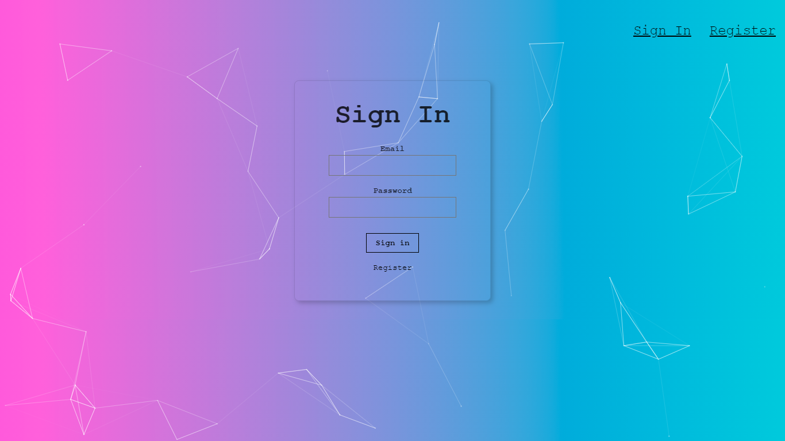
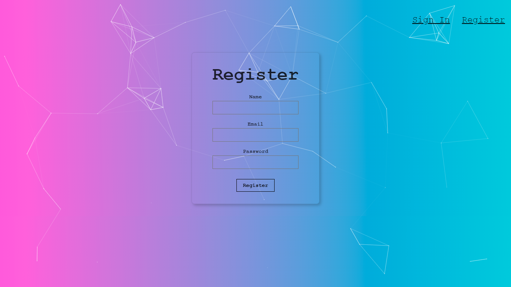
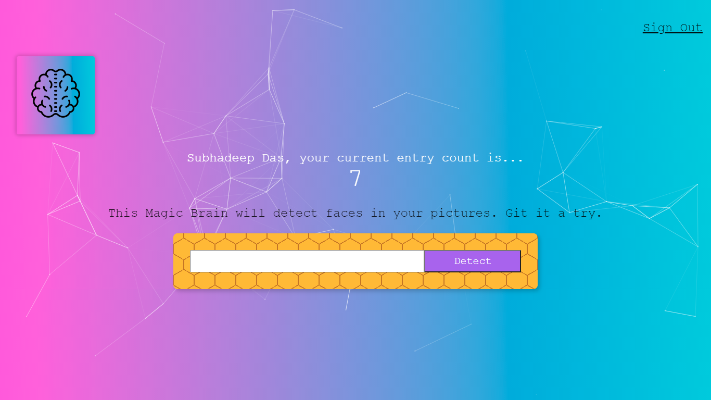
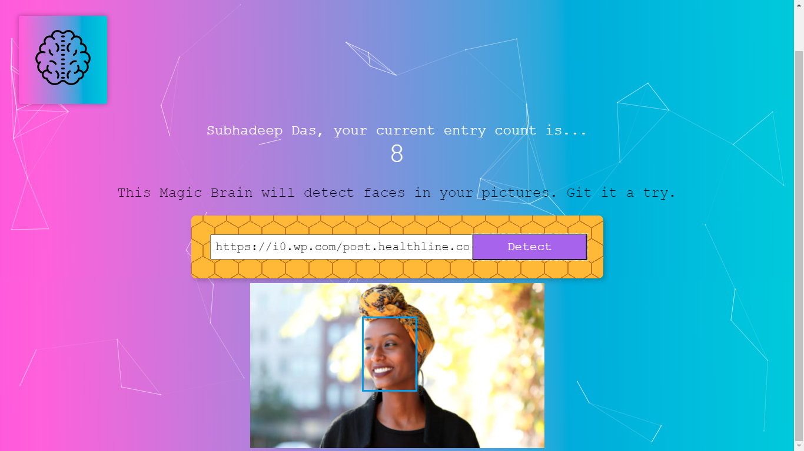

# Face-Detection-using-Clarifai-api
This is a face detection app created using React JS and Node JS. It uses the Clarifai api to perform face detection.

### You can view the live version of the app [here](https://real-time-face-detection.netlify.app/).

### Screenshots of the app:-

Instructions for setting up the backend and the frontend can be found within the readme files of those respective directories. 
This code base uses PostgreSQL as its relational database. To incorporate MySQL or SQLITE, refer to the Knex.js documentation [here](http://knexjs.org/).

### After creating your database, create these two tables:-

### 1)Users table- (For storing the data of the users who have registered)
   
   `CREATE TABLE users(
      id serial PRIMARY KEY,
      name VARCHAR(100),
      email text UNIQUE NOT NULL,
      entries BIGINT DEFAULT 0,
      joined TIMESTAMP NOT NULL
   );`

### 2)Login table- (For storing the logged in users)

   `CREATE TABLE login(
      id serial PRIMARY KEY,
      hash VARCHAR(100) NOT NULL,
      email text UNIQUE NOT NULL
   );`

### What i learnt from this project:-
1) Incorporating Clarifai api.
2) Making use of relational databases like PostgreSQL using Knex.js.
3) Finally i got to learn how to use hosting sites like Heroku and Netlify(I used Heroku for the backend and Netlify for the frontend).

